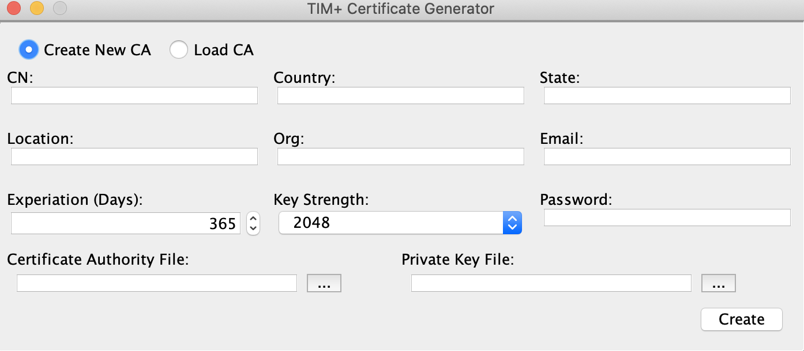
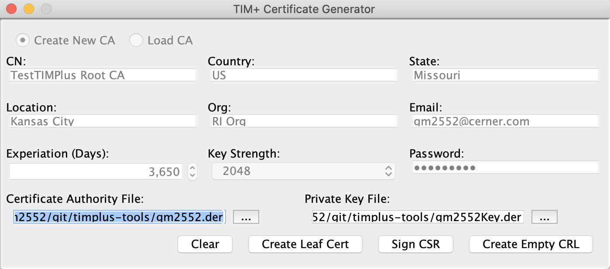
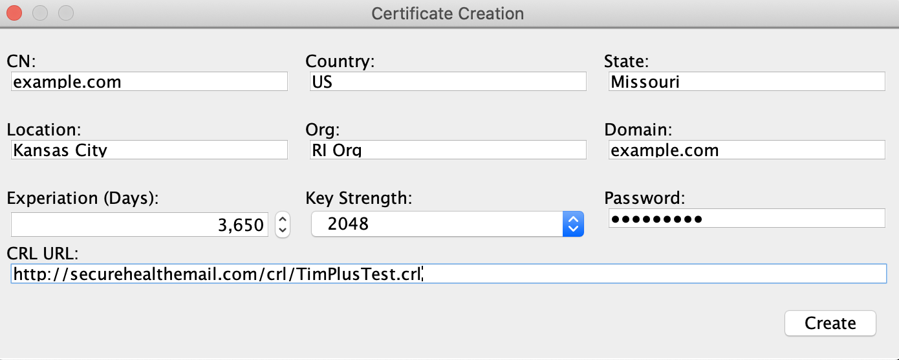
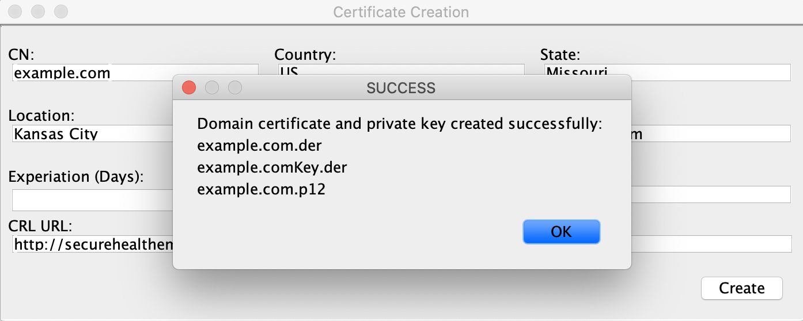

# Cerificate and Trust Anchor Creation

For productions environments, certificates and trust anchors are best obtained from commercial PKI services.  These services generally come with a relatively modest cost but can become prohibitive expense for testing purposes.  Tools such as openSSL can be used to generate test certificates, however they can be tedious to configure especially when needing to configure specific certificate attributes.  Although not recommended for production use, the reference implementation provides the TIMPlusCertGenerator tool for creating TIM+ compliant trust anchors and certificates.

## Certificate Jargon
TIM+ uses X509 certificates for TLS connections and X509 certificate authorities for enforcing trust between these connection. A certificate authority is actually just a certificate with certain fields, policies, extensions. Specifically a certificate authority is a certificate that can sign subordinate certificates using its private key and has its basic constraint policy set to true. Root certificates are certificate authorities whose issuer and subfields are the same.

Intermediate certificate authorities or intermediate signing certificates are certificate authorities that have been signed by a higher level certificate authority and whose issuer is the certificate that signed the intermediate certificate authority. As you can see, certificates can form hierarchies called chains, and in some PKI infrastructures can become very complex.

A leaf certificate is a certificate that is at the bottom of a certificate hierarchy. Using third party/commercial certificate authorities, leaf certificates are generally created using a certificate signing request (or CSR) that complies with the PKCS10 specification. CSRs are signed by the certificate authority to create the leaf certificates.

In TIM+, certificate authorities are used as anchors for trust validation of TLS connections.

## Generation Steps
As mentioned above, tools and commercial services are available for creating certificate chains, but they all follow the same general steps.  The TIMPlusCertGenerator application is a GUI based tool for creating a simple certificate chain for development purposes.  Certificates generated by this tool technically could be used for production, however they do not meet the requirements of a good certificate practice statement and don’t implement a fully functional PKI. They may, however, be appropriate for pilot and laboratory purposes.

The following sections will walk you through creating certificate chains using the TIMPlusCertGenerator tool.

### Obtain TIMPlusCertGenerator Tool

The TIMPlusCertGenerator tool can either be obtained from the maven central [repository](http://repo.maven.apache.org/maven2/org/directstandards/timplus-tools/1.0.0-SNAPSHOT/timplus-tools-1.0.0-SNAPSHOT.jar) or build it from source using the instructions [here](https://github.com/DirectStandards/timplus-ri-build/blob/master/README.md).  If building from source, the tool jar file will be found under the directory  _timplus-tools/target_ . 

Once you have downloaded or built the TIMPlusCertGenerator tool jar file, place it an appropriate location on GUI based system (the TIMPlusCertGenerator is a GUI tool and won't work in a command line only environment).

To run the tool, run the following command in the directory where you placed the tools's jar file.

```
java -jar timplus-tools-<version>.jar
```

### Creating A Chain From Scratch

The first step is creating a root certificate authority. The opening UI of the tool gives you an option of creating a new root CA or loading a CA from a pair of CA certificate and private key files.



To create a new root CA, select Create New CA and fill in the fields with the appropriate values.

The first six fields are used in the new CA’s distinguished name. The

* **CN**: Common name of the CA. This may be a short description of the CA. For example “Example.com Root CA”.
* **Country**: The country where the institution creating the CA exists.
* **State**: The state where the institution creating the CA exists.
* **Location**: Generally the city where the institution creating the CA exists.
* **Org**: The name of the company, institution, or organization within an institution creating the CA exists.
* **Email**: Email address of the administrator of the CA. This email is not related to the addresses used in certificate for signing and encrypting messages.

Remaining fields:

* **Expiration**: Number of days from today that the CA will be valid. Production level CAs are generally valid for up to 20 years, but the tool defaults to 1 year.
* **Key Strength**: The size in bits of the certificates public/private key pair. Production level root CAs generally use a key strength of 2048 or 4096 bits.
* **Password**: The password used to protect the CA’s private key (PKCS8) file. This may be empty, however some third party tools may have compatibility issues with empty passwords.
* **Certificate Authority File**: The name of the CAs public certificate file. If this is left blank, the application will automatically create the file using the email address if available other wise the CN field with the extension .der in the current working directory.
* **Private Key File**: The name of the CAs private key file. If this is left blank, the application will automatically create the file using the email address if available other wise the CN field concatenated with the extension key.der in the current working directory.

After all fields are filled in, clicking the **create** button will generate the CA’s certificate and PKCS8 private key files. The files will either be created in the working directory or in the locations specified by the  _Certificate Authority File_  and  _Private Key File_  fields. If the CA is generated successfully, a message will be displayed indicated the successful creation.

At this point you now have the option of creating a leaf certificate by clicking the **Crecte Leaf Cert** button, signing a PEM encoded CSR by clicking the **Sign CSR** button, or create an empty CRL file.



**NOTE:** Because TIM+ requires the use of certificate validation use CLRs, it is recommended to create an empty CRL file at this and deploy it to a publicly accessible web URL.  You will need this URL for leaf certificate creation.

If you click the Sign CSR button, you are presented with a file selection dialog where you will navigate to and select a PEM encoded CSR file that you want to sign. Once selected, the tool will sign the CSR using the CA’s private key and will generate a DER encoded certificate file.

If you click the **Crecte Leaf Cert** button, you are presented with the dialog to create a leaf certificate. Many of the fields are pre-populated with values from the Root CA.



The fields in the leaf certificate are almost identical to those in the CA with a few semantic exceptions:

*  **CN:** Common name of the certificate. This can be anything, but using a name of the entity or the name of the domain itself are good candidates.
*  **Domain**: This **MUST** name of the TIM+ domain that the certificate will be used for.

You will need to populate the CRL URL field with the publicly accessible URL of the CRL file published by the leaf certificate's root CA.

After filling out all fields, click the create button to generate the new leaf certificate. This will result in three new files that will be located in the tool’s working directory.

* Public certificate file
* Private key file
* PKCS12 file.

The names’ of the files are generated using the username of the email address of user level certificates or the domain name of org level certificates. For example, if a leaf certificate is generated for the email address greg@example.com, the following files are generate:

The names’ of the files are generated using the domain name of the certificate. For example, if a leaf certificate is generated for the example.com, the following files are generate:



example.com.der - The public certificate file.
example.comKey.der - The PKCS8 private key file in PCKS8 format. This is encrypted if the password field is populated.
example.com.p12 - The PCKS12 file that contains the public certificate and private key. NOTE This file is not encrypted or password protected. It is stored in a format that can be readily imported into the TIM+ admin tool.

### Creating A Chain From An Existing CA

If you already have a previously created certificate authority file and its private key, you can generate leaf certificates from this CA.

To create certificates from an existing CA, select the **Load CA** option from the tool’s opening dialog.

Next populate the  _Certificate Authority File_  and  _Private Key File_  fields with the location of the respective files. If the private key file is password protected, you must fill in the  _Password_  field with the correct password. After filling in all fields, click the **Load** button.

If the CA is loaded successfully, all of the fields will be populated with information from the CA. At this point you can now create leaf certificates by clicking the **Crecte Leaf Cert** button.