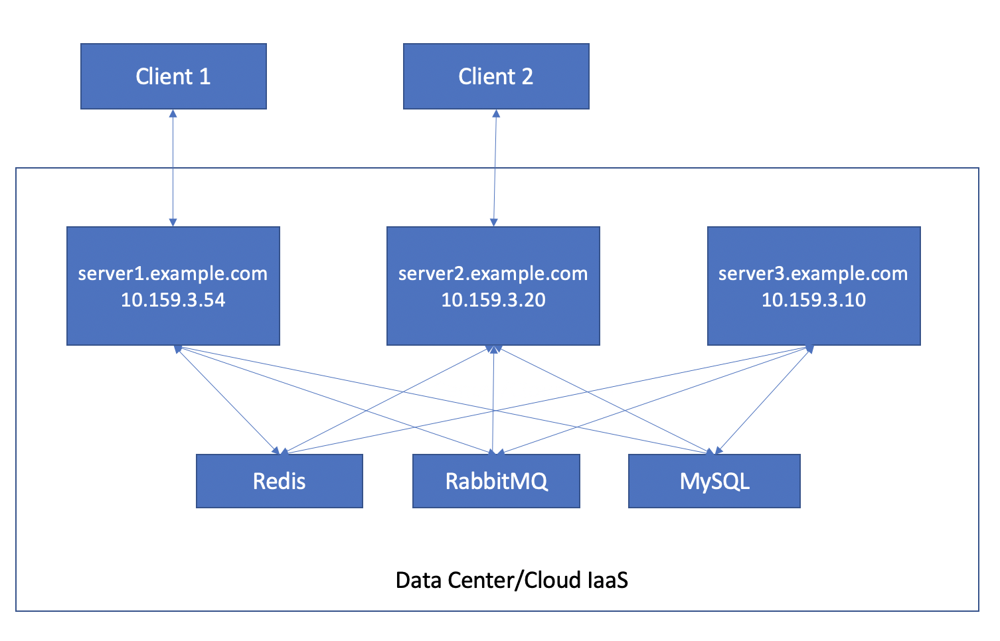

# Clustering Configuration

The TIM+ server application functions well as a stand alone instance, however, in production environments it will most likely be necessary to run multiple instances of the server for high availability and load balancing.  Because TIM+ is an extremely stateful protocol with persistent connections and other stateful attributes, multiple server instances must function together as a single logical cluster.  This section describes the necessary configuration to run multiple TIM+ server instances as a cluster.

## Clustering Topology

Clustering utilizes two or more instances of the TIM+ server application working together as a single logical unit.  Each server application instance is generally run on a separate node (recommended), however this isn't necessary so as long as each server application instance is listening on different TCP ports.  The server applications utilized three components for persisting stateful information and cluster messaging:

* Database:  The database stores long term persistent configuration information.  This is necessary even in a non-clustered configuration.
* Clustered Caching:  A lot of state information is stored using caches.  In standalone mode, the TIM+ server application uses an in memory cache.  In clustered mode, the server applications uses a clustered cache configuration.  The default cache implementation uses Redis.
* Clustered Messaging: When in clustered mode, client and remote TIM+ server connections are distributed across the nodes in the cluster.  Because messages must be delivered to client applications using their persistent connections to a discrete cluster node, messages received by one cluster node may need to be transmitted to another node for delivery to the destined clinet.  Clustered messaging allows TIM+ message to travel across nodes in the cluster to be delivered to the appropriate client application's connection.  The server application uses Spring Cloud Streams as the underlying messaging implementation and RabbitMQ and the default binding.

The diagram below illustrates an example cluster of three nodes running in a data center of public cloud using MySQL, Redis, and RabbitMQ as the clustering components.  It also illustrates two client applications that are connected to two different nodes in the cluster.

  

## Clustering Configuration

### Enable Clustering

To enable clustering in a server application instance, you must first indicate the server's intent to use clustering by adding the following configuration parameter to the server's application.yml or bootstrap.yml file.

```
timplus.server.enableClustering: false
```

### Database Configuration

As mentioned in the deployment guide, the server application uses a local hsql database that is written the server's local file system.  For clustering, you will need to use a database that is accessible by multiple instances of the server across multiple nodes.  You can update your application.yml or bootstrap.yml file with properties outlined in section 5 of the [spring boot appendix](https://docs.spring.io/spring-boot/docs/current/reference/html/appendix-application-properties.html#data-properties) to configure the connection to your database.

#### Example database deployment and configuration

This example launches a MySQL instance using docker running on a single node.  Assuming you have docker installed on a server node, you can launch an example instance of MySQL with docker using the following docker command

```
docker run -d -e MYSQL_ROOT_PASSWORD=direct  -e MYSQL_USER=nhind -e MYSQL_PASSWORD=nhind -e MYSQL_DATABASE=nhind -p 3306:3306 --name timplusmysql mysql/mysql-server:5.7
```

If you need startup this instance of MySQL at a later time, you can run the simple docker command below:

```
docker start timplusmysql 
```

Assuming you use the setting above, you can connect to the MySQL instance using the following configuration in your application.yml or bootstrap.yml file substituting in the correct ip address or node name.

```
spring:
  datasource:
    url: "jdbc:mysql://<ipaddress>:3306/nhind"
    username: nhind
    password: nhind  
```

### Redis Configuration

The default cluster cache implementation uses Redis.  To enable clustering, you will need to be running an instance of Redis and configure your server application instances to connect to the Redis instance.  You can update your application.yml or bootstrap.yml file with properties outlined in section 5 of the [spring boot appendix](https://docs.spring.io/spring-boot/docs/current/reference/html/appendix-application-properties.html#data-properties) to configure the connection to Redis.

#### Example Redis deployment and configuration

This example launches a Redis instance using docker running on a single node.  Assuming you have docker installed on a server node, you can launch an example instance of Redis with docker using the following docker command

```
docker run --name timplus-redis -p 6379:6379 -d redis --appendonly yes 
```

If you need startup this instance of Redis at a later time, you can run the simple docker command below:

```
docker start timplus-redis 
```

Assuming you use the setting above, you can connect to the Redis instance using the following configuration in your application.yml or bootstrap.yml file substituting in the correct ip address or node name.

```
spring:
  redis:
    host: <ipaddress>
```

### Redis Configuration

The default cluster messaging implementation uses RabbitMQ.  To enable clustering, you will need to be running an instance of RabbitMQ and configure your server application instances to connect to the RabbitMQ instance.  You can update your application.yml or bootstrap.yml file with properties outlined in section 8 of the [spring boot appendix](https://docs.spring.io/spring-boot/docs/current/reference/html/appendix-application-properties.html#common-application-properties-integration) to configure the connection to RabbitMQ.

#### Example RabbitMQ deployment and configuration

This example launches a RabbitMQ instance using docker running on a single node.  Assuming you have docker installed on a server node, you can launch an example instance of RabbitMQ with docker using the following docker command

```
docker run -d --hostname my-rabbit --name timplus-rabbit -p 15672:15672 -p 5672:5672 rabbitmq:3-management
```

If you need startup this instance of RabbitMQ at a later time, you can run the simple docker command below:

```
docker start timplus-rabbit
```

Assuming you use the setting above, you can connect to the RabbitMQ instance using the following configuration in your application.yml or bootstrap.yml file substituting in the correct ip address or node name.

```
spring:
  rabbitmq:
    host: <ipaddress>
```

You can connect to the RabbitMQ console from a web browerser using the following URL using guest/guest as the username and password:

```
http://<ipaddress>:15672/
```

### File Transfer Proxy Configuration

File transfers pose an interesting challenge in clustered configurations in that both the sender and receiver need to agree on connecting to the same stream host.  Depending on your networking strategy, each node may be exposed to the public internet individually by node name or IP address or may use a load balancer that exposes a single name or IP address. 

If you exposes each stream host (i.e. proxy server) to the internet using the server's IP address or node name, you will need to list each of these proxy servers using the timplus.filetransfer.proxy.host setting in the application.yml or bootstrap.yml file separating each proxy server name with a comma.  Using the topology at the top of this page, the configuration would look like the following:

```
timplus.filetransfer.proxy.host: server1.example.com,server2.example.com,server3.example.com
```

If you expose each the cluster as a single name or ip address using a load balancer, you only need to list this single name or ip address in your application.yml or bootstrap.yml file under the timplus.filetransfer.proxy.host setting.  In this scenario, both the file sender and receiver agree on the same stream host name to connect to, but the load balancer may connect the sender and receiver to different actual server nodes.  The TIM+ clustering logic is smart enough to detect this scenario in a clustered topology and automatically creates a logical link socket connection between the sender and receivers' nodes.  In other words, you don't need to worry about which nodes each party connect to as the cluster handles to messy cluster connection details for you.