# Trust Configuration

In TIM+, trust is general term referring to how disparate TIM+ servers authenticate and validate connections between them.  Trust uses X509 certificates and PKI mechanisms to establish trust between servers.  Before a TIM+ server can start trusting other TIM+ servers and vice versa, certificates and trust anchors must first be installed and configured in the server.

The process for configuring trust in the TIM+ server generally follows the following high level steps:

* Install Certificates
* Install and configure trust anchors and/or trust bundles
* Create and configure trust circles.
* Associate trust circles to domains

## Installing Certificates

As described in the [certificate creation section](CertificateCreation), you need to create an X509 end entity certificate for each of the TIM+ domains hosted by your server.  Depending on the mechanism used to create you certificates and private keys, the certificates and private keys may take various different forms.  The TIM+ server supports the following combinations of certificates and private keys for installing them into the server:

* Unprotected PKCS12 files:  This option allows you to install a PKCS12 file that has no password.  **NOTE:** PKCS12 files contain both the certificate and the private key.
* Password protected PKCS12 files: This option allows you to install PKCS12 file that has a password protecting the private key.
* Unprotected PKCS8 file: This option allows you to install a X509 certificate file and a private key file that has no password.
* Password protected PKCS8 file: This option allows you to install a X509 certificate file and a private key file that has a password protecting the private key.
* Wrapped PKCS8 file: This option allows you to install a X509 certificate file and a private key file that has been "wrapped" by an external symmetric key.  This option is used frequently with private keys that are generated on hardware security modules and exported using symmetric key wrapping.

Certificates are installed using the admin console web application.  After logging into the admin console, click on the _Server_ tab in the upper left portion of the screen and click the _Security And Trust_ sub tab.  You should then see and be able to click on the _Add New Certificate_ link in the navigation list on the left side of the admin console.

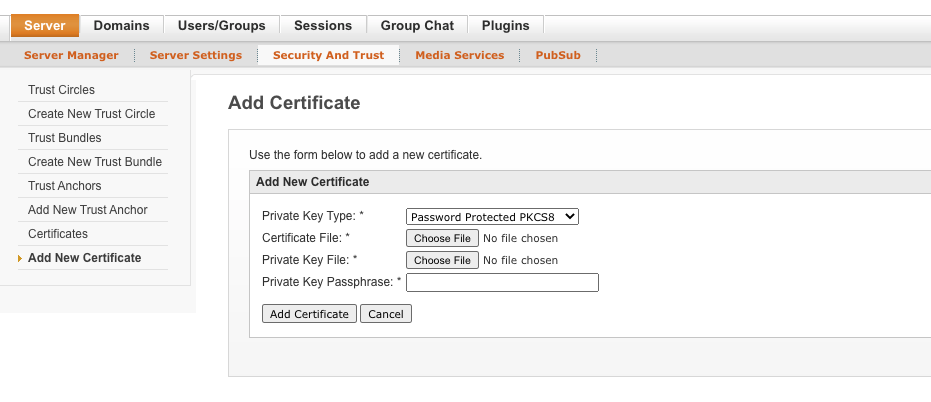

Select the appropriate combination of certificate and private key files using the _Private Key Type_ drop down box.  Next, choose your certificate file(s) and provide the private key pass phrase if necessary.  Finally, click on the _Add Certificate_ button to add the certificate.  If the certificate and private key are successfully added to the system, you will see you the newly added certificate listed in the _Certificates_ page.  The _Certificates_ page lists all end entity certificates installed in your server.

**NOTE:** The TIM+ admin console only supports certificate and private keys files that are in DER format.  Using PEM format files will result in an error.

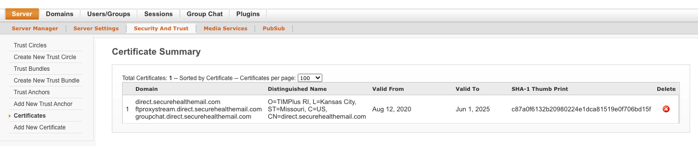 

## Installing Trust Anchors

Trust anchors are used to validate that a peer's end entity certificate is a certificate that should be trusted.  If the peer's certificate successfully _chains_ to a trust anchor install in your TIM+ server, then the certificate is considered to be trusted and the server to server connection can be successfully established.

Trust anchors are installed using the admin console web application.  Click on the _Server_ tab in the upper left portion of the screen and click the _Security And Trust_ sub tab.  You should then see and be able to click on the _Add New Trust Anchor_ link in the navigation list on the left side of the admin console.

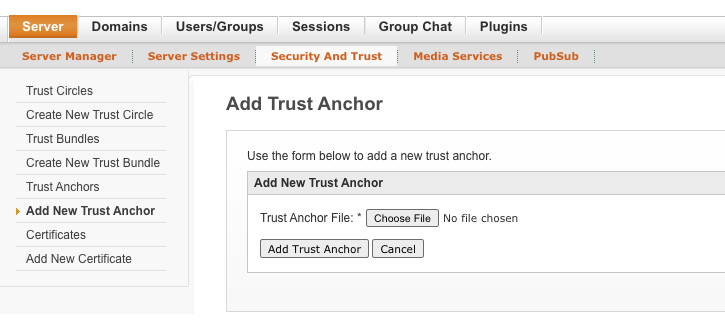

Choose your trust file and click on the _Add Trust Anchor_ button.  If the trust anchor is successfully added to the system, you will see you the newly added trust anchor listed in the _Trust Anchors_ page.  The _Trust Anchors_ page lists all of the individual trust anchors installed in your server.  A more scalable approach to adding trust anchors is to use trust bundles described in the next section.

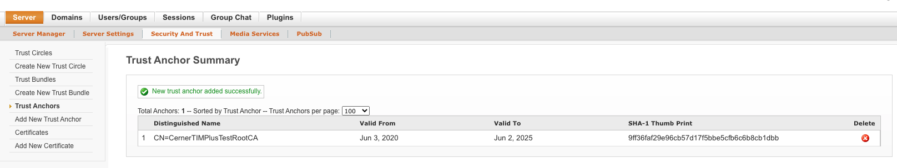 

## Installing Trust Bundles

Trust bundles are a mechanism to group a set of trust anchors into a single collection.  Generally trust bundles represent a trust community where all anchors within the trust bundle comply with the same set of policies and governance requirements.

Trust bundles are installed using the admin console web application.  lick on the _Server_ tab in the upper left portion of the screen and click the _Security And Trust_ sub tab.  You should then see and be able to click on the _Create New Trust Bundle_ link in the navigation list on the left side of the admin console.
C

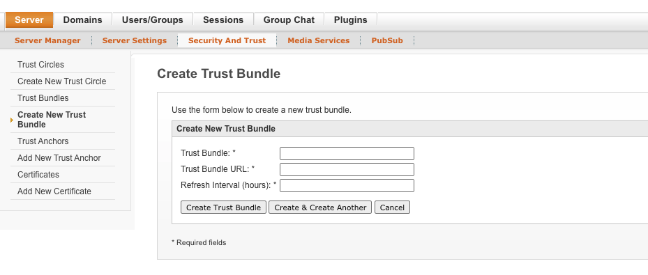 

Give the trust bundle an appropriate name that describes the trust bundle (it can be anything you want) and provide the URL where the trust bundle is located.  Next, provide the refresh interval in hours.  Finally, click the _Create Trust Bundle_ button.  If the trust bundle is successfully added to the system, you will see you the newly added trust bundle listed in the _Trust Bundles_ page.  The _Trust Bundle_ page lists all trust bundles installed in your server.

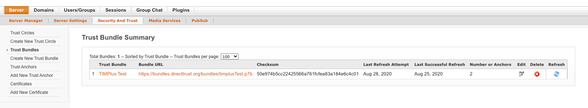 

To view the trust anchors and other properties of the trust bundle, click the trust bundle name in the trust bundle summary list.  You can also manually refresh the bundle to pull updates from the trust bundle summary list or click on the _Refresh Bundle_ button on the _Trust Bundle Properties_ page.

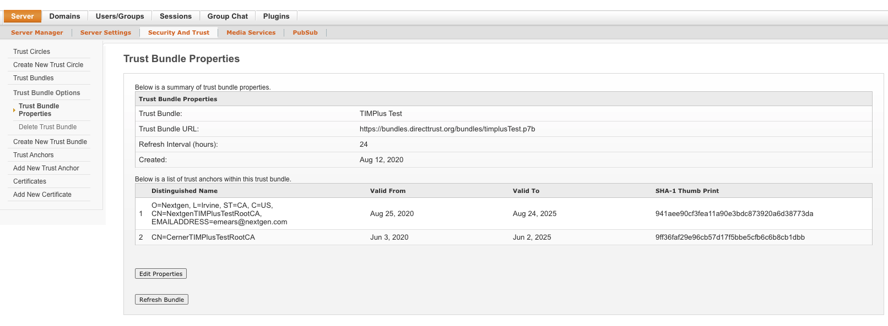 

## Creating Trust Circles

Trust circles are a collection of trust bundles and trust anchors.  They are intended to create a scalable configuration pattern for associating trust anchors to domains.  Domains are associated to trust circles which allows a domain to trust any certificate that chains to an anchor within the trust circle.  Multiple domains may utilize a single trust circle allowing a domain's trust to be configured quickly.  Any changes made to a trust bundle or a trust anchor within a trust circle automatically updates the trust configuration of every domain associated to the trust circle.  For example, if a new trust bundle is added to a trust circle, every domain associated to that trust circle will automatically include the newly added trust bundle to its trust configuration.

Trust circles are created using the admin console web application.  Click on the _Server_ tab in the upper left portion of the screen and click the _Security And Trust_ sub tab.  You should then see and be able to click on the _Create New Trust Circle_ link in the navigation list on the left side of the admin console. 

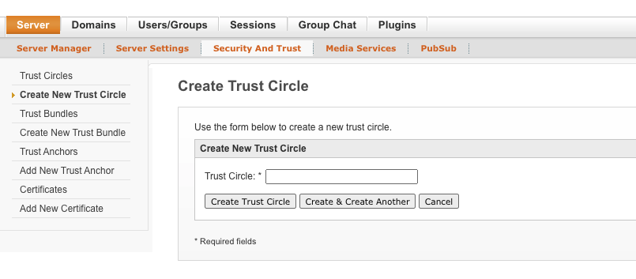 

Give the trust circle an appropriate name that describes the trust circle (it can be anything you want) and click the _Create Trust Bundle_ button.  If the trust circle is successfully added to the system, you will see you the newly added trust circle listed in the _Trust Circles_ page.  The _Trust Circles_ page lists all trust circles installed in your server.  The list shows how many domains are associated to the circle, how many bundles are included in the circle, and how may individual trust anchors (not included in a trust bundle) are in the circle.

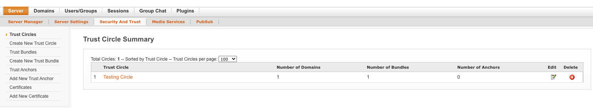 

To configure which trust bundles and trust anchors should be included in the trust circle, click the trust circle name from the trust circle summary list.  You will then be able to select which trust anchors and trust bundles you want associated with this trust circle.  Once you have completed the trust circle configuration, click on the _Save Settings_ button.

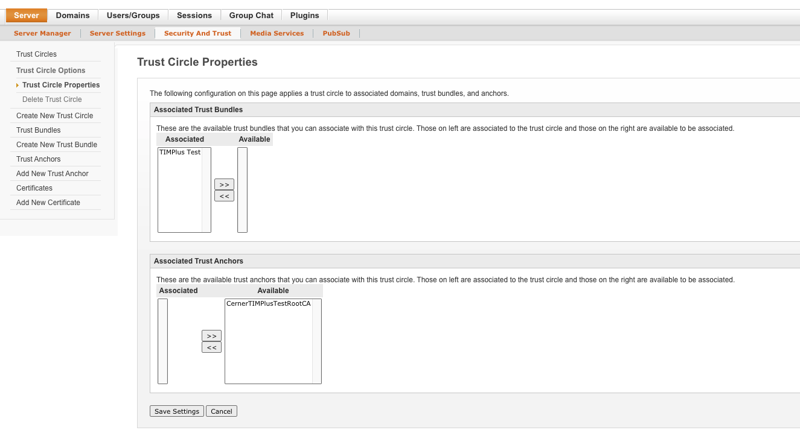 

## Adding Trust Circles To A Domain

TIM+ domains must be associated to at least one trust circle before they begin to trust other TIM+ domains.  A domain may incorporate one of many trust circles to its trust configuration.

Trust circles are associated to TIM+ domains using the admin console web application.  Click on the _Domains_ tab in the upper portion of the screen which should take you to the _Domain Summary_.  Click on the name of the domain that you wish to configure and you be taken to the _Domain Properties_ page.  Click on the "Edit Properties" button.

From the _Domain Properties_ page, you will see a list of configured trust circles in your server.  Move the trust circles that you want associated to the domain into the _Associated_ list.  Click the _Save Properties_ button when done.

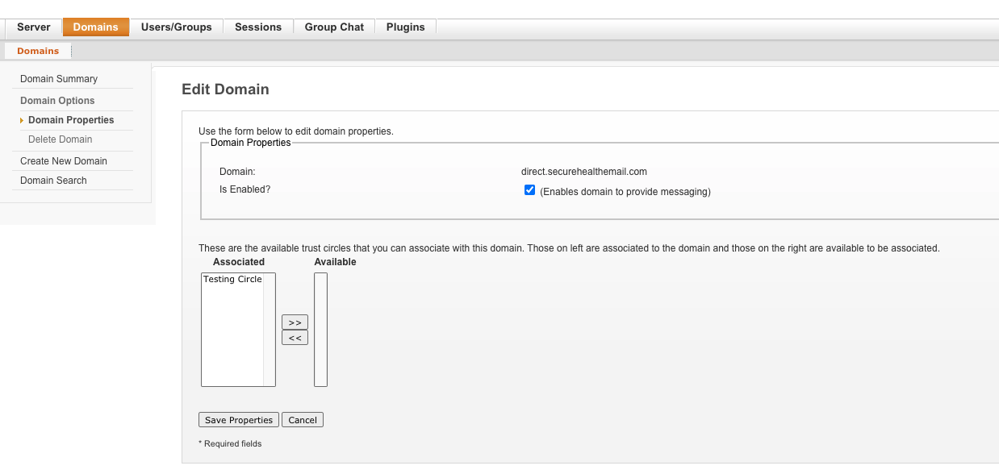 